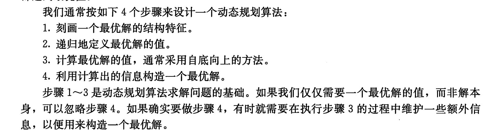
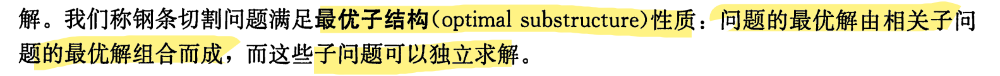
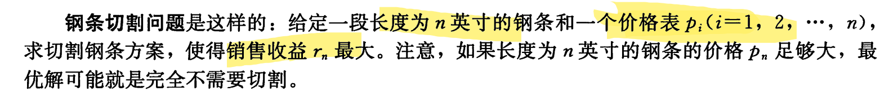
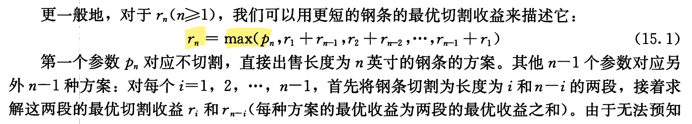
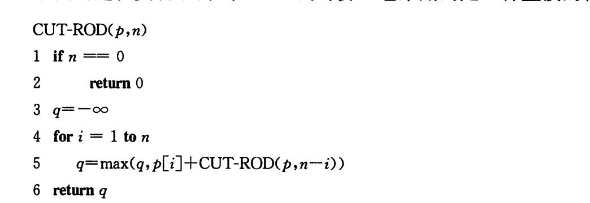
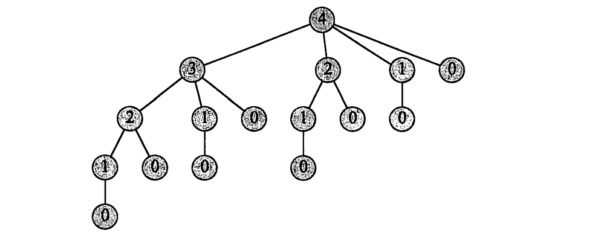
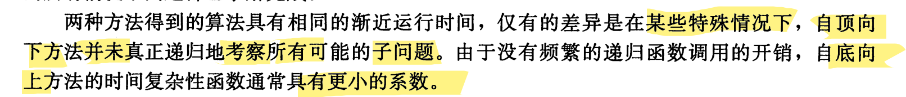

写题的时候大部分题目都是有对应的解决套路的

有些是跟特定的数据结构有关, 有些则需要算法思想来解题


## 解题步骤

先读题目, 读完

写出输入的所有情况

思考用什么算法和数据结构

注意数组或集合的边界

注意返回值问题


## 算法思想

- 二分法
- 分治法
- 双指针
- 滑动窗口

### 动态规划

> << 算法导论>>



问题需满足最优子结构




#### 切割钢条问题



列举出所有可能的切割方案 , 从中选出收益最大的, rn代表n英寸的最优切割收益



要求n英寸的最优解, 就要先求子问题的最优解

```
求解 : r1 r2 r3 ... rn

r1=p1

r2 = max(p2, r1+r1)

r3 = max(p3, r1+r2,r2+r1)

...

rn = max(pn, r(1)+r(n-1), r(2)+r(n-2) , ... ,r(n-1)+r(1) )
```

代码实现



```
代码运行解析:
i=1
q = max(-1,p[1]+fun(p,n-1))
i=2
q = max(q, p[2]+fun(p,n-2))
i=3
q = max(q, p[3]+fun(p,n-3))
...
i=n
q = max(q, p[4]+fun(p,n-n))
```

在此过程中 fun()反复的求解相同的子问题 , 下图时调用fun(p, 4)时的过程



此过程的优化方案 :

将求解过的子问题结果保存下来, 如果后面需要, 直接查找即可, 用空间换时间

实现方法:

1. 带备忘的自定向下法

   用自然的递归编写过程, 在过程中保存子问题结果并查找

2. 自底向上法

   将子问题按规模从小到大排序后求解, 并保存结果

> 第二种更好
>
> 


### 回溯法

> 感觉回溯法不是很独立, 像是广度和深度优先搜索的进阶 , 加一个是否遍历的条件
>
> 条件包括题目的要求, 以及是否遍历过
>
> 有时是否遍历过还要用个数组单独记录
>
> 或者遍历到时改变值用来检验是否遍历过, 然后当前位置后面的遍历结束后, 把当前位置的值改回来

- 广度优先搜索
- 深度优先搜索
- 位运算

## 数据结构

栈

队列

树

图

哈希表